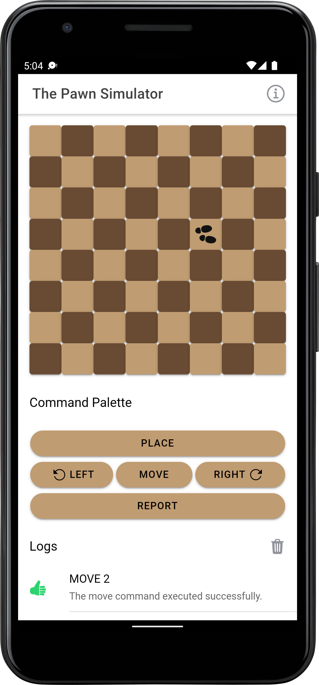
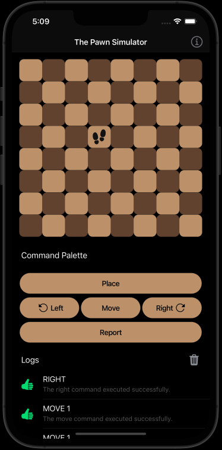

# The Pawn Simulator

<p>


</p>

## Run the app

```shell
npm install 
ionic serve
```

## Run the unit test

```shell
ng test
```

## Run the app in device

```shell
ionic build
npx cap sync
npx cap run android
npx cap run ios
```
